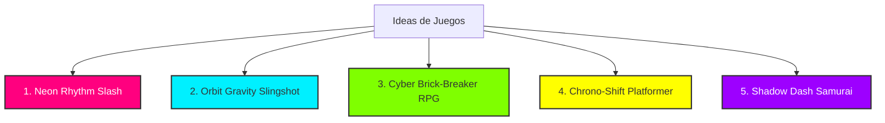

# 🎮 Guía de Inspiración: Cómo Crear un Juego Visual, Impresionante y Divertido

¡Qué excelente iniciativa! Crear un juego es una de las mejores formas de dominar la programación, y centrarse en la **jugabilidad interactiva (game feel)** y la **estética visual** desde el principio es exactamente lo que diferencia a los juegos mediocres de los memorables.

Para que tu juego sea un éxito rotundo, dividiremos esta guía en dos partes:
1. **Los 5 Secretos del "Juice" (Jugosidad):** Cómo hacer que cualquier mecánica simple se sienta increíble e impresionante.
2. **5 Propuestas de Juegos:** Ideas con un nivel de dificultad moderado (retadores pero muy viables de programar) que destacan visualmente.

---

## ⚡ Parte 1: Los 5 Secretos del "Juice" (Game Feel)

En la industria de los videojuegos, el *"Juice"* (jugosidad) se refiere a la retroalimentación visual y auditiva constante que recibe el jugador al interactuar con el juego. Si un jugador presiona un botón, ¡el juego debe reaccionar de forma exagerada y satisfactoria!

Aquí tienes las 5 técnicas que implementaremos para que tu juego se vea **ultra-premium**:

### 1. Screen Shake (Sacudida de Pantalla)
* **Qué es:** Hacer que la cámara vibre ligeramente cuando ocurre algo importante (un golpe, una explosión, una caída fuerte o al alcanzar una velocidad máxima).
* **Por qué impacta:** Da una sensación física de fuerza y peso. Un bloque que se rompe sin vibración es aburrido; un bloque que sacude la pantalla al romperse se siente poderoso.

### 2. Sistemas de Partículas (Sparks, Dust, Trail)
* **Qué es:** Generar pequeños círculos, cuadrados o líneas de colores que salgan volando y desaparezcan gradualmente.
* **Ejemplos:** 
  * Polvo al saltar o frenar.
  * Chispas metálicas cuando el personaje choca contra una pared.
  * Estrellas brillantes que flotan cuando recolectas una moneda.
  * Una estela (trail) de luz que sigue al jugador si se mueve rápido.

### 3. Squash and Stretch (Deformación Elástica)
* **Qué es:** Deformar ligeramente los sprites o formas de los objetos según sus fuerzas físicas.
* **Ejemplos:**
  * Al saltar, el personaje se estira verticalmente (`scaleY: 1.2`, `scaleX: 0.8`).
  * Al caer y tocar el suelo, se aplasta horizontalmente (`scaleY: 0.7`, `scaleX: 1.3`) antes de volver a su forma original suavemente.
  * Esto hace que los objetos rígidos parezcan vivos y orgánicos.

### 4. Interpolación Suave (Lerp & Easing)
* **Qué es:** Evitar movimientos lineales y secos. En su lugar, usa fórmulas de aproximación suave (`Linear Interpolation` o `Lerp`) para que la cámara siga al jugador con un leve retraso orgánico, o para que los menús se deslicen de forma fluida.
* **Fórmula clave:** `cámara.x += (jugador.x - cámara.x) * 0.1` (la cámara persigue al jugador con suavidad infinita).

### 5. Estética de Neón, Brillos y Parallax
* **Qué es:** 
  * **Brillo (Glow):** Usar fondos muy oscuros o negros con elementos de colores neón extremadamente vibrantes (rosa, cian, verde lima). Añadiendo un filtro de sombra difusa (`shadowBlur` en canvas o `drop-shadow` en CSS), logramos un efecto de luz espectacular.
  * **Parallax Scrolling:** Si el fondo tiene varias capas que se mueven a diferentes velocidades, se crea una ilusión increíble de profundidad 3D en un entorno 2D.

---

## 🕹️ Parte 2: 5 Ideas de Juegos Impresionantes (Nivel Medio)

Aquí tienes 5 conceptos que evitan los clichés típicos (como el clásico Snake o Flappy Bird plano) pero que siguen siendo muy viables de construir usando **HTML5 Canvas puro** o **JavaScript con CSS dinámico**.

---

### 1. 🎵 Neon Rhythm Slash (Runner Rítmico de Neón)
* **El Concepto:** Un juego de carrera infinita (runner) en perspectiva lateral sobre rieles de neón. Los obstáculos y coleccionables aparecen al ritmo de una música electrónica de fondo. El jugador tiene dos botones: **Saltar/Esquivar** y **Cortar/Atacar** (estilo *Muse Dash* o *Beat Saber 2D*).
* **Por qué se ve impresionante:**
  * La pantalla pulsa al ritmo de los bajos de la música.
  * Cortar un objeto genera chispas de neón y una sacudida de pantalla.
  * El jugador deja un rastro holográfico de sí mismo al moverse.
* **Nivel de programación:** **Moderado**. El movimiento es automático en el eje X, solo manejas saltos/ataques en el eje Y. La música genera los obstáculos usando patrones de tiempo predefinidos en un Array.

---

### 2. 🚀 Orbit Gravity Slingshot (Navegación Gravitacional)
* **El Concepto:** Controlas una pequeña sonda brillante perdida en el espacio. No tienes propulsores directos; en su lugar, te mueves **enganchándote a la gravedad de los planetas**. Si mantienes presionado el clic, la nave entra en órbita alrededor del planeta más cercano. Al soltar el clic, sales disparado tangencialmente como una honda espacial hacia el siguiente planeta, esquivando asteroides y agujeros negros.
* **Por qué se ve impresionante:**
  * Estelas de luz hiper-suaves que trazan el camino de la nave.
  * Los planetas tienen órbitas dibujadas con líneas semi-transparentes brillantes.
  * Colisiones espaciales que disuelven tu nave en miles de estrellas.
* **Nivel de programación:** **Moderado-Fácil**. La física se basa en trigonometría básica (vectores de atracción gravitacional y velocidad angular). No requiere mapas de colisión complejos, solo distancias entre puntos (círculos).

---

### 3. ⚡ Cyber Brick-Breaker RPG (Destructor de Ladrillos con Habilidades)
* **El Concepto:** Una reinvención moderna de *Arkanoid*. Controlas una barra inferior que rebota una bola de energía para destruir bloques superiores. Sin embargo, los bloques son enemigos robóticos que te disparan y tienen barra de vida. Cada bloque destruido te da cristales para activar **habilidades activas** (ej. disparar láseres desde la barra, dividir la bola en 10 mini-bolas, o ralentizar el tiempo).
* **Por qué se ve impresionante:**
  * Reacciones en cadena masivas que llenan la pantalla de números de daño flotantes y destellos.
  * Habilidades con efectos visuales deslumbrantes (un rayo láser gigante de neón).
  * Fondo interactivo de matriz cibernética.
* **Nivel de programación:** **Moderado**. La base es el clásico Brick-Breaker, pero añade un sistema de estado para los bloques (vida, tipo) y habilidades que alteran variables globales como la velocidad del juego o el conteo de bolas.

---

### 4. ⏳ Chrono-Shift Puzzle (Plataformas con Rebobinado Temporal)
* **El Concepto:** Un juego de plataformas 2D minimalista donde el jugador debe llegar a la salida esquivando trampas láser y plataformas móviles que caen. ¿La mecánica especial? Tienes un botón para **rebobinar los últimos 5 segundos del tiempo** para el entorno o para ti mismo, permitiéndote resolver acertijos como saltar sobre una plataforma que ya se cayó, o esquivar un proyectil letal.
* **Por qué se ve impresionante:**
  * Efecto visual de rebobinado: filtro monocromático o glitch en la pantalla, líneas de escaneo analógicas y distorsión cromática.
  * Deja un holograma de tu "yo del pasado" mostrando lo que hiciste antes de rebobinar.
* **Nivel de programación:** **Moderado-Avanzado**. Para hacer el rebobinado, simplemente almacenas las últimas N posiciones y estados del personaje/objetos en un array circular y, cuando se activa, lees el array a la inversa frame por frame.

---

### 5. 🥷 Shadow Dash Samurai (Combate Táctico Ultra Veloz)
* **El Concepto:** Eres un guerrero cibernético en una arena oscura. Los enemigos aparecen desde los bordes de la pantalla. En lugar de caminar lento, tu único método de ataque y movimiento es un **Dash instantáneo (desplazamiento súper rápido)**. Dibujas una línea con el ratón o apuntas con las flechas, y al presionar la tecla, el personaje atraviesa instantáneamente a todos los enemigos en esa trayectoria, cortándolos al estilo anime.
* **Por qué se ve impresionante:**
  * El "efecto tajo": la acción se congela por 0.1 segundos y luego se dibuja una hermosa línea brillante de corte, haciendo explotar a los enemigos en chispas de neón al mismo tiempo.
  * Si realizas un dash perfecto justo antes de recibir un golpe, entra en modo cámara lenta (*bullet time*).
* **Nivel de programación:** **Moderado**. El movimiento del dash es una simple línea recta matemática de un punto A a un punto B. Compruebas qué enemigos colisionan con ese segmento de recta y aplicas el daño.

---

## 🛠️ ¿Cuál es la mejor tecnología para empezar?

Para que podamos crearlo juntos directamente en tu espacio de trabajo y que funcione al instante en cualquier navegador con gráficos fluidos a 60fps, te recomiendo:
1. **HTML5 Canvas + Vanilla CSS / JavaScript:** Ideal para juegos 2D interactivos porque nos da control absoluto sobre cada píxel, permitiendo efectos de partículas optimizados y efectos visuales sin depender de librerías lentas.
2. **Vite + React (opcional):** Si queremos estructurar menús complejos, inventarios y pantallas de configuración usando componentes dinámicos y elegantes de una forma moderna.

---

### 🤔 ¿Cuál te llama más la atención?
Dime cuál de estas propuestas te inspira más, o si tienes una mezcla de ideas en mente. Una vez elijas una dirección, **podemos empezar a programarla juntos paso a paso**, diseñando primero un prototipo visual increíble y luego añadiendo los niveles y mecánicas. 🚀
